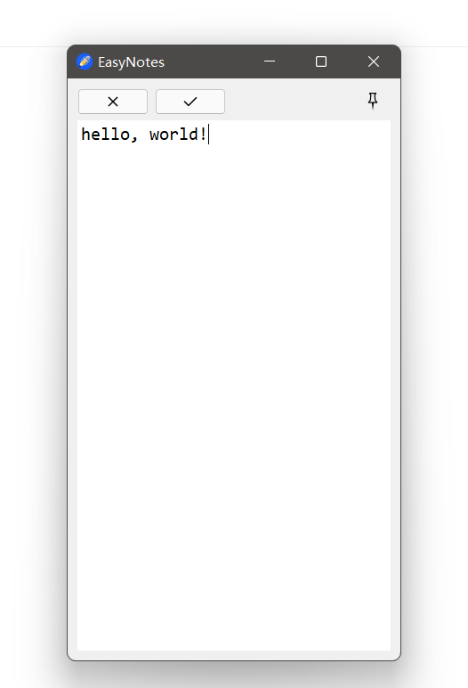

## EasyNotes

针对 windows x64 的一款笔记软件：EasyNotes🎉

<table rules = none frame=void>
	<tr>
		<td>
            
        </td>
		<td align="left" valign="top">
              
        	1.软件可以把随手记得笔记保存为markdown文件或txt文件 
            2.界面简洁，只有三个按钮:
            <ul>
            <li>×按钮</li> 清空当前输入框中内容
            <li>√按钮</li> 保存当前输入框中内容到某个文件
            <li>pin按钮</li> 将 EasyNotes 置于桌面顶层，或取消置顶
            </ul>
        </td>
	</tr>
</table>

